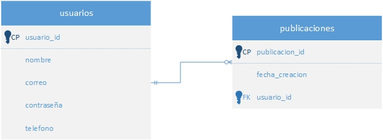

Hola!, vamos a continuar la conexión de un proyecto FastAPI a una base de datos existente SQL Server desde Windows. Esta vez vamos a ver cómo podemos obtener la estructura de las tablas existentes.

<!-- truncate -->

Una vez que hicimos la conexión explicada en la [parte 1](/fastapi-mssql-1), tenemos que poder realizar consultas a la base de dato. Al ser un proyecto existente, la base de datos ya cuenta con tablas creadas.
Una de las formas seria escribir manualmente los modelos para replicar lo existente en la base de datos. Pero puede ser que sea una base de datos con muchas tablas y podría ser un procedimiento muy engorroso.

FastAPI , o mejor dicho SQLAlchemy, que es el ORM, nos provee una forma de "reflejar" las estructuras de las tablas existentes. Podríamos reflejar todas las tablas de una sola vez de la siguiente forma:

```python showLineNumbers
metadata_obj = MetaData()
metadata_obj.reflect(bind=someengine)
Tabla1 = metadata_obj.tables["Tabla1"]
Tabla2 = metadata_obj.tables["Tabla2"]
```

Y también se puede ir reflejando por tablas individuales, que es el que termine usando porque no necesitaba todas las tablas, y puedo ir agregando a medida que necesite más tablas. Para ello primero supongamos que tenemos las siguientes tablas en la base de datos:



Donde tenemos usuarios y sus publicaciones. Y para reflejar tablas usamos _Table_, que importamos de _sqlalchemy_

```python showLineNumbers title="/database/reflection.py"
from sqlalchemy import MetaData, Table
from database.session import engine

metadata = MetaData()

# Tablas reflejadas.
usuarios_table = Table("usuarios", metadata, autoload_with=engine)
publicaciones_table = Table("publicaciones", metadata, autoload_with=engine)
```

En donde:

- _Table_ para representar la tabla de la base de datos.
- _metadata_ sirve para extraer toda la metadata de la tabla (relaciones, índices, campos, etc.)
- _engine_ para realizar las consultas a la base de datos, y carga en tiempo de ejecución la estructura.

:::tip

Si quieres reflejar las tablas y trabajar directamente con el ORM puedes revisar [`automap`](https://docs.sqlalchemy.org/en/20/orm/extensions/automap.html)

:::

Por lo que ahora podemos usar lo reflejado para armar nuestros modelos.

```python showLineNumbers title="/database/models/usuario.py"
from sqlalchemy.ext.declarative import declarative_base
from database.reflection import (
    usuarios_table,
    publicaciones_table
    )

Base = declarative_base()


class Usuarios(Base):
    __tablename__ = "Usuarios"
    __table__ = usuarios_table

class Publicaciones(Base):
    __tablename__ = "Publicaciones"
    __table__ = usuarios_table
```

De esa forma ya tendríamos la estructura de las tablas y sus metadatos para poder trabajar, y si su estructura cambia se vería reflejado en tiempo de ejecución.

Y de esta forma podemos obtener la estructura y sus metadatos para poder trabajar con ellos.
