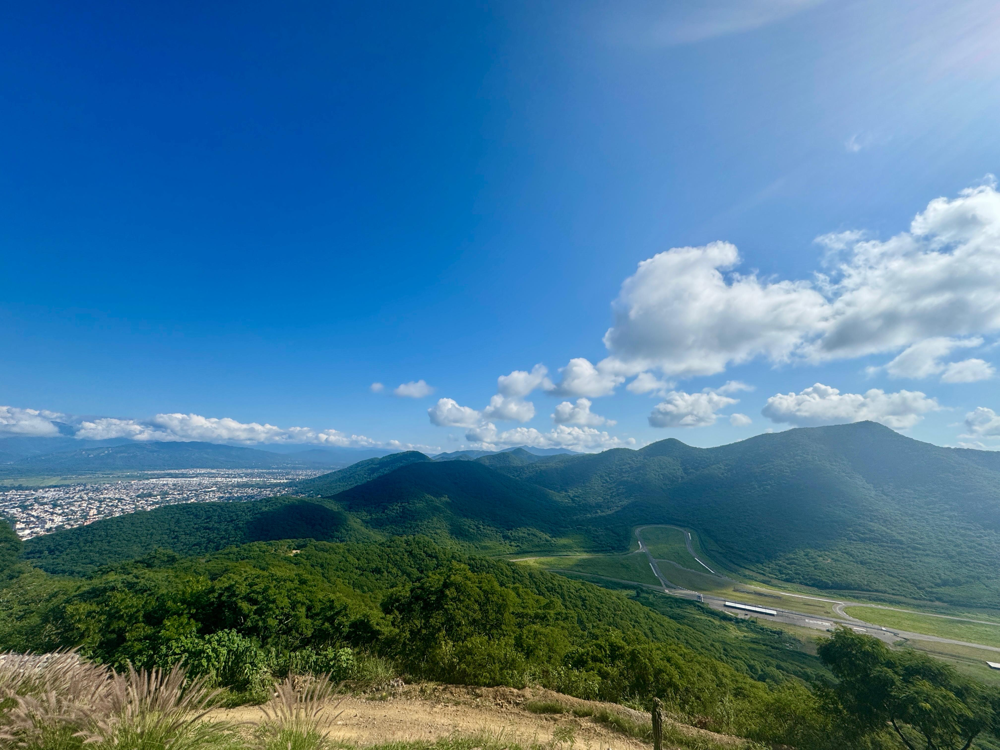
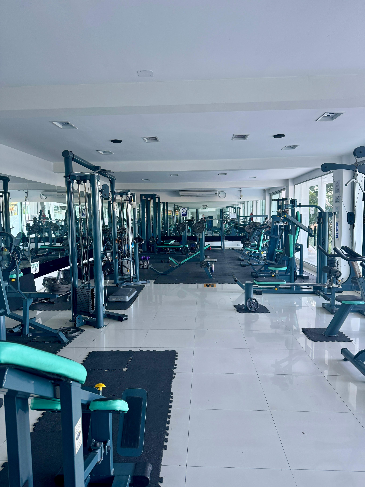

Hola, hoy quiero hablar sobre la importancia de mantenernos físicamente activos, especialmente en una profesión como la nuestra, donde pasamos demasiadas horas sentados frente a una pantalla.

<!-- truncate -->

En el desarrollo de software es muy común pasar jornadas extensas frente a la computadora. Aunque el desgaste no siempre es físico, sí es profundamente mental. El estrés acumulado, la presión por resolver problemas, los bugs inesperados y los cambios constantes terminan afectando tanto el cuerpo como la mente.

En mi caso, hace algunos años me sentía con poca energía al terminar el día. Llegaba agotado, sin claridad mental y con una condición física bastante deteriorada. Lo más preocupante no era solo el cansancio, sino la dificultad para manejar la frustración cuando algo no salía como esperaba.

Por eso decidí cambiar. Hace aproximadamente dos años comencé a entrenar de forma constante, combinando trabajo cardiovascular y entrenamiento de fuerza.

El cambio no tardó en notarse.

Me sentía más activo, con mayor energía y mejor descanso. Pero lo más interesante fue el impacto en el plano mental y profesional. Comencé a manejar mejor la frustración, a encarar los problemas técnicos con mayor enfoque y a tomar decisiones con más claridad.

El estrés que antes acumulaba durante el día empezó a disminuir. Aprendí algo que el entrenamiento enseña muy bien: los resultados no son inmediatos, el progreso es gradual y la constancia supera a la motivación.

En nuestra profesión, la frustración es parte del proceso. Hay días donde nada compila, donde un incidente en producción aparece sin previo aviso o donde un problema parece no tener solución. El entrenamiento físico me ayudó a regular esa respuesta emocional.

Hoy no entreno solamente por salud física. Entreno para mantener mi mente estable, para reducir el estrés y para sostener un mejor rendimiento profesional.

Mi recomendación es simple: incorporar alguna actividad física de manera constante. No tiene que ser extrema. Puede ser caminar, correr, hacer fuerza o simplemente moverse más.

El impacto no solo se verá en el cuerpo. Se reflejará directamente en la claridad mental, en la tolerancia a la frustración y en la calidad de nuestro trabajo.
